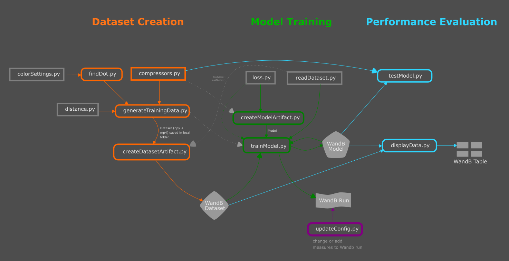

# Point-Recognition

Estimating position of the index finger from a single picture.
Vision of the project is to create a human-computer-interface which doesn't need a mouse and enables the user to interact using rich and intuitive gestures.

## Flow Chart of submodules

# Dataset Creation
Training data are generated by capturing images of my hand, with the index finger position labelled automatically by a pink dot on the finger. The dot is removed in the image before training. For every image exists a 3-dimensinal label consisting of X and Y for the position of the hand in the frame and Z representing the height of the hand above the table. The X and Y positions of the red point at the index finger are recorded by a webcam mounted above, the Z coordinate is recorded by a webcam on the table.

## Experimenting with different image formats

The images are compressed to different small pixel sizes. Different compressors are used, keeping for example hue and grayscale or saturation values instead of rgb values.

# Building the model

The model should generate a three-dimensional continuous output (X,Y,Z).

# Loss function

The model should be able to evaluate the s